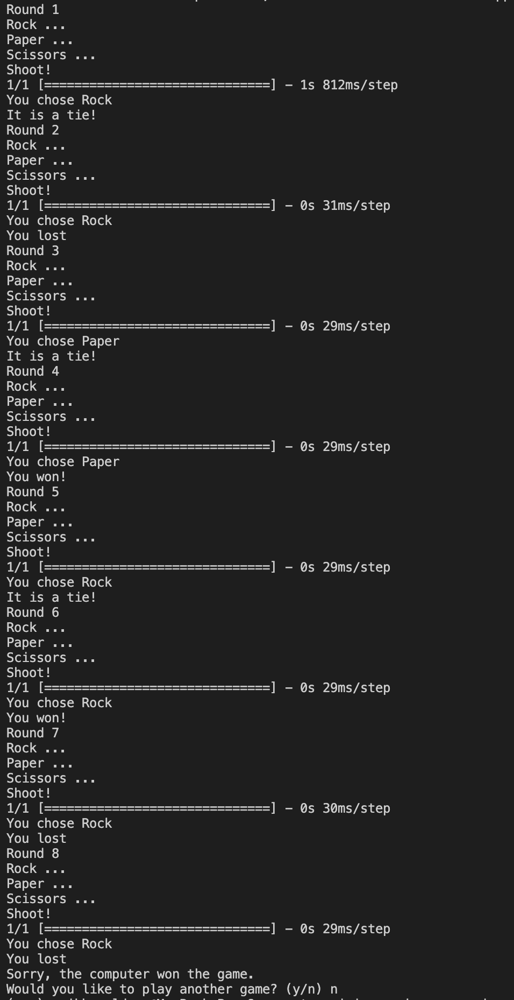

# Computer Vision Rock Paper Scissors

In this project I will train a convolutional neural network with images of me showing a rock, paper, scissors symbol as well as me showing nothing with my hands to teach a model to distinguish between these symbols. This will be done using teachable machine (https://teachablemachine.withgoogle.com/).

I will use keras in a python script to feed the model an image from my laptop camera that shows me showing one of these signs and give a prediction of what the model thinks I am holding up.

This will then be integrated into a game that I will program so that I will be able to play a game of best to 3 against the computer (where the computer will choose randomly one of the options).

## Milestone 1
- Git is a VCS (Version Control System) which can utilised distributed version control along with GitHub to track changes to files, collaborate with others, display code publicly for others to read/use, and revert to old version of a codebase. These technologies are used widely in industry as they allow for safe collaboration on software projects with multiple people.

## Milestone 2
- I created an image model on teachable machine for 4 different classes: Nothing, Rock, Paper, and Scissors. The model is a pretrained neural network with the images I provided becoming the last layer of the network.

## Milestone 3
- For the game of rock, paper, scissors; a new virtual environment was created using `conda create -n {name}` where name represents the name of the new environment. This environment is then activated by `conda activate {name}`. In this new environment; the following packages were installed: opencv-python, tensorflow, and ipykernel. The ML model that was downloaded was also tested using the test_dependencies.py file. I also checked the model by running this file and when a new picture is taken the model.predict() method returns an array of the models certainties for each class: Rock, Paper, Scissors, Nothing. I then found the max of these values using numpys `np.argmax()` function to calculate the index of the models prediction and then indexed a string array of the possible classes to print out the prediction that the camera sees.

## Milestone 4
- A manual game of Rock, Paper, Scissors was created where the camera and ML model is not used. It uses the random module to get the computer's choice and uses the input function to get the choice from the player. The game consists of a play() function that is called to start the game. In this function the script calls get_computer_choice and get_user_choice to get the choices of the two players and calculates a winnner using the get_winner function. The latter function has the rules of the game hardcoded to print whether the computer or the player has won the game. This is all found in the manual_rps.py script.

## Milestone 5
- I have used keras to load the model accessed from teachable machine to a variable named model. The model has a predict method to calculate the prediction of what the player is showing to the camera. The result of `model.predict(data)` is a numpy array for the confidence score for each class. The max score is indexed using `index = np.argmax(prediction)` which can then be used to access a string value for the option chosing. 

- I also converted the game to class (RPS) which has a play() method that can be called to start a game of rock, paper, and scissors. 

- The following screenshot shows an example of the game being played.

- To improve the user experience, I could show an image of the computer's choice.
